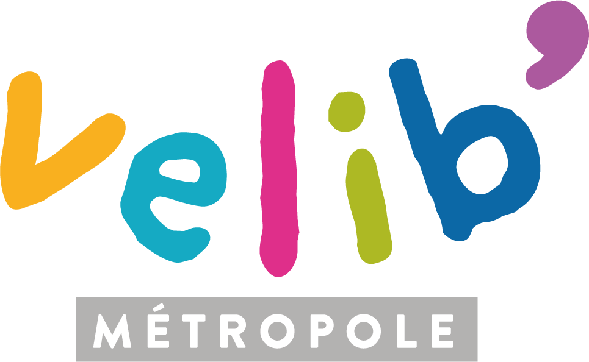

```{r include=FALSE}
library(httr)
library(jsonlite)
library(leaflet)
library(dplyr)
library(ggplot2)

urlStatus <- "https://velib-metropole-opendata.smoove.pro/opendata/Velib_Metropole/station_status.json"
urlInformations <- "https://velib-metropole-opendata.smoove.pro/opendata/Velib_Metropole/station_information.json"

status <- GET(urlStatus, verbose())
status_text <- content(status, "text")
status_json <- fromJSON(status_text, flatten = TRUE)
status_df <- as.data.frame(status_json)

info <- GET(urlInformations, verbose())
info_text <- content(info, "text")
info_json <- fromJSON(info_text, flatten = TRUE)
info_df <- as.data.frame(info_json)

velib = left_join(info_df, status_df, by="data.stations.stationCode")

totalEBikeAvailable <- 0
totalMechanicalBikeAvailable <- 0

x <- 0
for (x in 1:nrow(velib)) {
  totalEBikeAvailable = totalEBikeAvailable + velib[[15]][[x]]$ebike[[2]]
  totalMechanicalBikeAvailable = totalMechanicalBikeAvailable + velib[[15]][[x]]$mechanical[[1]]
}


percentageVelibAvailable <- round(sum(velib$data.stations.num_bikes_available) / sum(velib$data.stations.capacity) * 100, digits = 2)
percentageDocksAvailable <- round(sum(velib$data.stations.num_docks_available) / sum(velib$data.stations.capacity) * 100, digits = 2)

pal <- colorFactor (c("#FF0000FF", "#FFFF00FF", "#00FF00FF", "#00FFFFFF", "#0000FFFF", "#FF00FFFF"), domain = velib$data.stations.capacity)
popup_info = paste(velib$data.stations.name, "<br/>", "Capacité maximale de la station : ", velib$data.stations.capacity, "<br/>", "Vélos disponibles actuellement : ", velib$data.stations.num_bikes_available) 
```

{#id .img width=193px height=118.8px}
<h1> Paris area's velib stations cartography : </h1>


```{r echo=FALSE}
leaflet() %>%
  addTiles() %>%
    addMarkers(
      data = velib, 
      lat = ~data.stations.lat, 
      lng = ~data.stations.lon, 
      popup = ~popup_info, 
      clusterOptions = markerClusterOptions(
                                            iconCreateFunction =
                                                                JS("
                                                                  function(cluster) {
                                                                     return new L.DivIcon({
                                                                       html: '<div style=\"color:white; background-color:rgba(0,147,255,1)\"><span>' + cluster.getChildCount() + '</div><span>',
                                                                       className: 'marker-cluster'
                                                                     }); 
                                                                   }")))

```


<h2> Rayan </h2>

<div>
  Velib availability : `r percentageVelibAvailable`%   
  Docks availability : `r percentageDocksAvailable`%
</div>

```{r echo=FALSE}
data <- data.frame(
  category=c("Mechanical bikes", "E-Bikes"),
  count=c(totalMechanicalBikeAvailable, totalEBikeAvailable)
)
 
# Compute percentages
data$fraction <- data$count / sum(data$count)

# Compute the cumulative percentages (top of each rectangle)
data$ymax <- cumsum(data$fraction)

# Compute the bottom of each rectangle
data$ymin <- c(0, head(data$ymax, n=-1))

# Compute label position
data$labelPosition <- (data$ymax + data$ymin) / 2

# Compute a good label
data$label <- paste0(data$count)

# Make the plot
ggplot(data, aes(ymax=ymax, ymin=ymin, xmax=4, xmin=3, fill=category)) +
  geom_rect() +
  geom_text( x=2, aes(y=labelPosition, label=label), size=6) + # x here controls label position (inner / outer)
  scale_fill_brewer(palette=7) +
  scale_color_brewer(palette=7) +
  coord_polar(theta="y") +
  xlim(c(-1, 4)) +
  theme_void()
```


Autres templates de map possibles :
```{r echo=FALSE}
leaflet() %>%
  addProviderTiles(providers$Stamen.Toner) %>% 
  addMarkers(
    data = velib, 
    lat = ~data.stations.lat, 
    lng = ~data.stations.lon, 
    popup = ~popup_info, 
    clusterOptions = markerClusterOptions(iconCreateFunction = JS("
                                                                  function(cluster) {
                                                                     return new L.DivIcon({
                                                                       html: '<div style=\"color:white; background-color:rgba(0,147,255,1)\"><span>' + cluster.getChildCount() + '</div><span>',
                                                                       className: 'marker-cluster'
                                                                     }); 
                                                                   }")))

leaflet() %>% 
  addProviderTiles(providers$CartoDB.Positron) %>% 
  addMarkers(
    data = velib, 
    lat = ~data.stations.lat, 
    lng = ~data.stations.lon, 
    popup = ~popup_info, 
    clusterOptions = markerClusterOptions(iconCreateFunction = JS("
                                          function(cluster) {
                                             return new L.DivIcon({
                                               html: '<div style=\"color:white; background-color:rgba(0,147,255,1)\"><span>' + cluster.getChildCount() + '</div><span>',
                                               className: 'marker-cluster'
                                             }); 
                                           }")))


leaflet() %>% 
  addProviderTiles(providers$Esri.NatGeoWorldMap) %>% 
  addMarkers(
    data = velib, 
    lat = ~data.stations.lat, 
    lng = ~data.stations.lon, 
    popup = ~popup_info, 
    clusterOptions = markerClusterOptions(iconCreateFunction = JS("
                                          function(cluster) {
                                             return new L.DivIcon({
                                               html: '<div style=\"color:white; background-color:rgba(0,147,255,1)\"><span>' + cluster.getChildCount() + '</div><span>',
                                               className: 'marker-cluster'
                                             }); 
                                           }")))

leaflet() %>% 
  addProviderTiles(providers$MtbMap) %>%
  addProviderTiles(
    providers$Stamen.TonerLines,
    options = providerTileOptions(opacity = 0.35)
    ) %>%
  addProviderTiles(providers$Stamen.TonerLabels) %>% 
  addMarkers(
    data = velib, 
    lat = ~data.stations.lat, 
    lng = ~data.stations.lon, 
    popup = ~popup_info, 
    clusterOptions = markerClusterOptions(iconCreateFunction = JS("
                                          function(cluster) {
                                             return new L.DivIcon({
                                               html: '<div style=\"color:white; background-color:rgba(0,147,255,1)\"><span>' + cluster.getChildCount() + '</div><span>',
                                               className: 'marker-cluster'
                                             }); 
                                           }")))


leaflet() %>% 
  addTiles() %>% 
  addMarkers(
    data = velib, 
    lat = ~data.stations.lat, 
    lng = ~data.stations.lon, 
    popup = ~popup_info, 
    clusterOptions = markerClusterOptions(iconCreateFunction = JS("
                                          function(cluster) {
                                             return new L.DivIcon({
                                               html: '<div style=\"color:white; background-color:rgba(0,147,255,1)\"><span>' + cluster.getChildCount() + '</div><span>',
                                               className: 'marker-cluster'
                                             }); 
                                           }")))


```


<h2> Abdel </h2>
```{r}


```


<h2> Karine </h2>
```{r}

```

<h2> Mohamed </h2>
```{r}

```


<h2> Mathieu </h2>
```{r}

```

